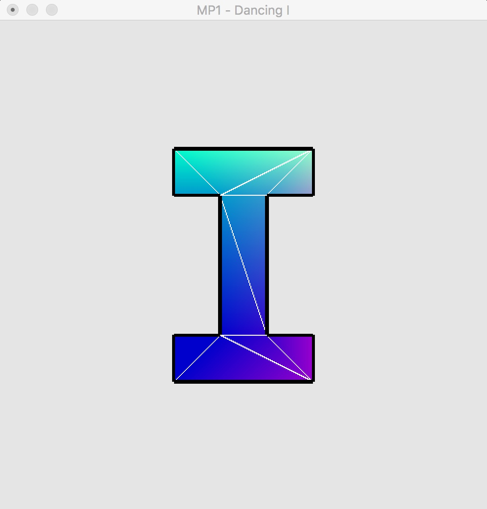

# CS 418 - MP1 | The Dancing I

The task description can be view in [here](http://graphics.cs.illinois.edu/cs418/sp16/mp1).

The program is tested with Xcode under OSX.

## Basic Information

1. Platform:  OSX 10.11.3
2. Build Environment: Xcode 7.2.1
3. Language: C++
4. External Library Used: GLUT

## Program Instructions

1. ** How to Build **. You need have OpenGL and GLUT to get this work. For setting up the environment, please refer to [this link](http://web.eecs.umich.edu/~sugih/courses/eecs487/glut-howto/).
Other than these two libraries, three files needed include:
        main.cpp
        dancing_I.cpp
        dancing_I.hpp
2. ** How to Run **. An unix excutable program is available in the folder which you can directly open. Otherwise, it is also possible to build the source code from project file.
3. ** How to Interact **. Keyboard is used for interacting with the program. 
There are five keys availble, with following instructions:

    <<<<<<<<<< Keyboard Help >>>>>>>>>>>
    
    a   | Show / Hide Animation         
    f   | Show / Hide Filled I          
    o   | Show / Hide Triangle Outlines  
    b   | Show / Hide Border            
    Esc | Quit
    
## The Final Results
Here is a quick snapshot of the program. Key points are:

    1.The I character is formed with 16 glVertex calls in GL_TRIANGLE_STRIP mode.
    2.Color at each vertex is depending on its position in the screen.
    3.The whole I is shaking with sin() functions.

You may refer to following link for details.
https://youtu.be/rcRpXoU8q34
 