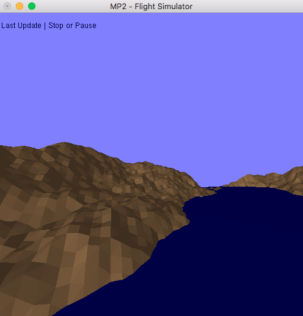

# CS 418 - MP2 | Flight Simulator

The task description can be view in [here](http://graphics.cs.illinois.edu/cs418/sp16/mp2).

The program is tested with Xcode under OSX.

## Basic Information

1. Platform:  OSX 10.11.3
2. Build Environment: Xcode 7.2.1
3. Language: C++
4. External Library Used: GLUT, OpenGL

## Program Instructions

#### How to Build 
You need have OpenGL and GLUT to get this work. For setting up the environment, please refer to [this link](http://web.eecs.umich.edu/~sugih/courses/eecs487/glut-howto/).
Other than these two libraries, three files needed include:
        main.cpp
        Camera.cpp, Camera.hpp
        Model.cpp, Model.hpp
        Shader.cpp, Shader.hpp
#### How to Run
You should build the source code from project file. Shaders files need to be read in during run time. Thus to use two shader files, namely 'v_shader.glsl' and 'f_shader.glsl', you have to put those files within the SAME folder as excutable program. 
#### How to Interact
Keyboard is used for interacting with the program. 
There are keys availble, with following instructions:

    <<<<<<<<<<<<< Keyboard Help >>>>>>>>>>>>>
    -----------------------------------------
    +/- | Edit Sea Level                     
    f/c | Edit Polygon Size                  
    p   | Start / Pause Forward              
    -----------------------------------------
    [a/d] ROLL  |  [w/s] PITCH  | [q/e] YAW  
    [UP/DOWN] Forward Speed                  
    [LEFT/RIGHT] Rotate Speed                
    -----------------------------------------
    Esc | Quit            
    
## The Final Results
Here is a quick snapshot of the program. Key points are:

1. The Flight is able to fly around with proper ROLL/PITCH/YAW.
2. The Flight is able to change forward speed or rotate speed.
3. Simple vertex shader and fragment shader with Phong Reflection Model is integrated into pipeline.
4. A Text Feedback is displayed at left-up corner.

You may refer to following link for details.
https://youtu.be/6hNkIoqOz2A
 