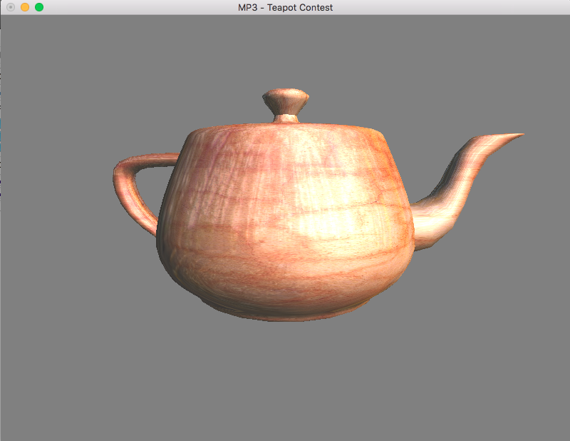

# CS 418 - MP3 | Teapot Contest

The task description can be view in [here](http://graphics.cs.illinois.edu/cs418/sp16/mp3).

The program is tested in Xcode under OSX.

## Basic Information

1. Platform:  OSX 10.11.3
2. Build Environment: Xcode 7.2.1
3. Language: C++
4. External Library Used: GLUT, OpenGL, objLoader(http://www.kixor.net/dev/objloader/)

## Program Instructions

#### How to Build 
You need have OpenGL and GLUT to get this work. For setting up the environment, please refer to [this link](http://web.eecs.umich.edu/~sugih/courses/eecs487/glut-howto/).
Other than these two libraries, following files needed include:
    - （major functions)
        main.cpp
        Model.cpp, Model.hpp
        
    - ./helper: (helper functions)
        Shader.cpp, Shader.hpp
        readppm.cpp, readppm.h
        helper.cpp, helper.hpp
    
    - ./obj_loader: (small library from http://www.kixor.net/dev/objloader/)
        list.cpp, list.h
        obj_parser.cpp, obj_parser.h
        objLoader.cpp, objLoader.h
        string_extra.cpp, string_extra.h
        
#### How to Run
You should build the project using all source codes above. And put everything UNDER ./test within the SAME folder as excutable program.

#### How to Interact
Keyboard is used for interacting with the program. 
There are keys availble, with following instructions:

    <<<<<<<<<<<<< Keyboard Help >>>>>>>>>>>>>
    -----------------------------------------
    W/S | Rotate teapot up or down                     
    A/D | Rotate teapot left or right                  
    Q/E | Move teapot forwards or backwards                            
    -----------------------------------------
    Esc | Quit            
    
## The Final Results
Here is a quick snapshot of the program. Key points are:

1. The teapot is properly loaded and rendered in correct projection
2. Hidden surface is removed
3. The teapot is textured as a mix of lights, texture image and sphere environment map
4. Vertex and fragment shader are writen to perform the mixture of texture, enviroment and lights.
5. Simple and reasonable interactive interface.

You may refer to following link for details.
https://youtu.be/a7XQ1kdUytE

 